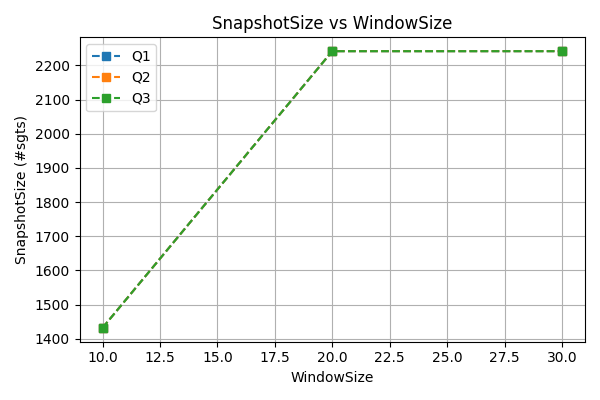
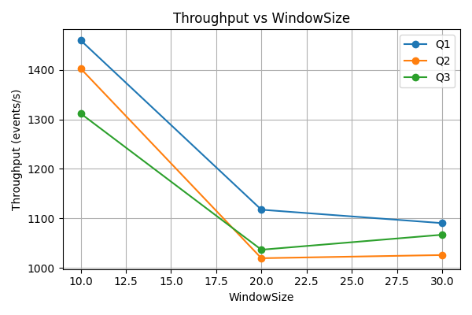

# Paper implementation of "Evaluating Complex Queries on Streaming Graphs" by Pacaci & al.

<center>

<span style="font-size: 150%;">

Project [DATA Systems Research](https://www.riccardotommasini.com/courses/research-insa-ot/) is provided by [INSA Lyon](https://www.insa-lyon.fr/).

</span>

</center>

## Students: 
- **Diego LARRAZ MARTIN** — diego.larraz-martin@insa-lyon.fr
- **Doha ES-SOUFI** — doha.es-soufi@insa-lyon.fr  
- **Amadou SOW** — amadou.sow@insa-lyon.fr 
  
## Papers: 

>PACACI, Anil; BONIFATI, Angela; ÖZSU, M. Tamer. Evaluating complex queries on streaming graphs. En 2022 IEEE 38th International Conference on Data Engineering (ICDE). IEEE, 2022. p. 272-285.<br>
Url: https://ieeexplore.ieee.org/abstract/document/9835463/


>Iterative SPATH implementation algorithm:
Xiangyang Gou, Xinyi Ye, Lei Zou & Jeffrey Xu Yu. “LM‑SRPQ: Efficiently Answering Regular Path Query in Streaming Graphs.” Proceedings of the VLDB Endowment, Vol. 17, No. 5, pp. 1047–1059, 2024. DOI: 10.14778/3641204.3641214. (Algorithm 1)
Url: https://mod.wict.pku.edu.cn/docs/20240422170756302199.pdf 

---

## Dataset for testing: 
https://snap.stanford.edu/data/sx-stackoverflow.html

datasets/
- sx-stackoverflow-a2q.txt
- sx-stackoverflow-c2q.txt
- sx-stackoverflow-c2a.txt

## Launching:

0. Remove debugs

If debugging or any terminal information of advancement isn't necessary you can comment:
- Every `out.collect(` in .../processors/StreamingProcessor.java (Both in processElement and onTimer lines 145 and 173).
- The `.print();` in the stream pipeline, line 229

Also for debugging purposes a timer is set between each event generation in `stack-overflow.py`. Furthermore and given there are +17M rows per dataset, an event limit has been set. Both can be commented or modified in the file.

To finish, the `StreamProcessor` possesses a `SERIALIZE_EVERY` attribute that indicates every how many events passed do we serailize results and metrics into a file `project_dir/results/results_X.txt` (X being the number of events passed and averaged upon).
  
<br>
  
1. Launch the dataset feeder from a socket
```bash
...project_dir/$> python stack-overflow.py 8080
```
(The port can be changed but needs to do so too in Main.py of the project, when creating StreamProcessor)

<br>

2. Launch the java code from Main.py in `streamgraph_queries`

<br>

## Optimizations:

### 1. IndexPath Updating
All nodes (<vertex name, state>) refer to their parents by a pointer. Changing their parents is simply changing their pointer. Paths can simply be obtained by recursively searching parents until the desired node or root of the tree is found.
All existing paths (source, target) are also documented as metadata in `resultTimestamps`.

### 2. Expansions from an edge incoming
Instead of the snapshotGraph, we give a Hashmap that returns, for each vertex, the edges they take part in inside the snapshot, updated iteratively along the snapshot StreamingGraph.
```java
private HashMap<String, HashSet<Edge>> vertexEdges; // Per Vertex (v), all current existing edges where v = e.src, for efficiency in spath
```

Helps when expanding in spath instead of searching ALL streaming graph edges adn check if child == new_src:

```java
HashSet<Edge> snapshotEdgesFromChild = vertexEdgesSnapshot.get(childNode_i.getName());
if (snapshotEdgesFromChild == null) {continue;}
for (Edge e: snapshotEdgesFromChild) {
  //... Expansion
}
```

### 3. IndexPath Expiration

Upon expiring an edge in the snapshot StreamingGraph or `vertexEdges` we need to check if an index path is no longer available.

This is done very easily with two structures:
```java
private TreeMap<Long, Set<NodeKey>> resultTimestamps; // Per StartTime timestamp -> set of path keys: <SpanningTreeRoot, targetKey of path (<vertex name, state>)>
private HashMap<NodeKey, Long> lookup; // PathKey -> ts
```

The ordered TreeMap where paths are grouped by their timestamp makes it so that we only have to check a few timestamp values by polling, and expire them all together while ts < (current_ts - WINDOW_SIZE).

Now the important point is we ONLY have to expire the pathTargetKey node and not all of its parents, given childNode.ts <= parentNode.ts in the IndexPath, thus the parents will be eliminated along (on the same set of ts) or will be eliminated later on. 

Simple O(1) per remove, given spanning trees are HashMaps of NodeKeys.

## Benchmark:

| SnapshotSize vs WindowSize| Throughput vs WindowSize  |
|--------------------------|---------------------------|
| |   |


## License

This repository was developed as part of a college reproducibility project at INSA Lyon. 
Its purpose is to implement and experiment with the algorithms described in the prior mentionned papers.

While the code is dedicated to the public domain under Creative Commons CC0 1.0 Universal (CC0 1.0) License (see [LICENSE](./LICENSE) for details), it was primarily created for **educational and research purposes**.

## Institute logo

<center>


</center>
